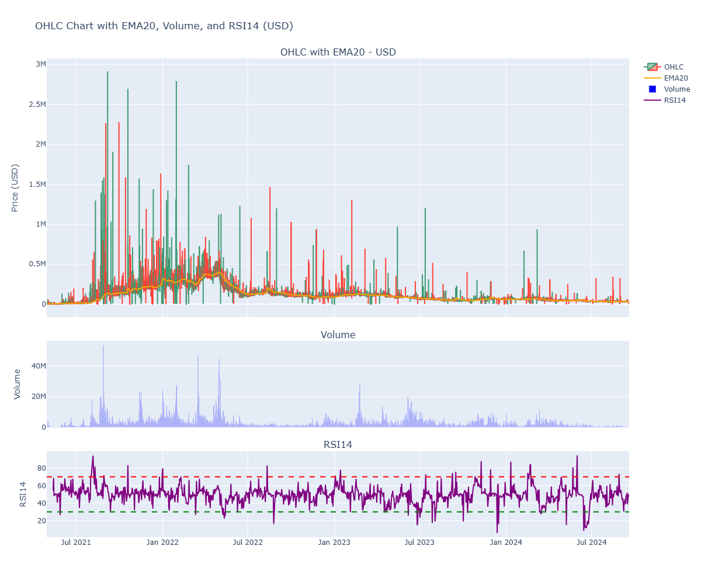
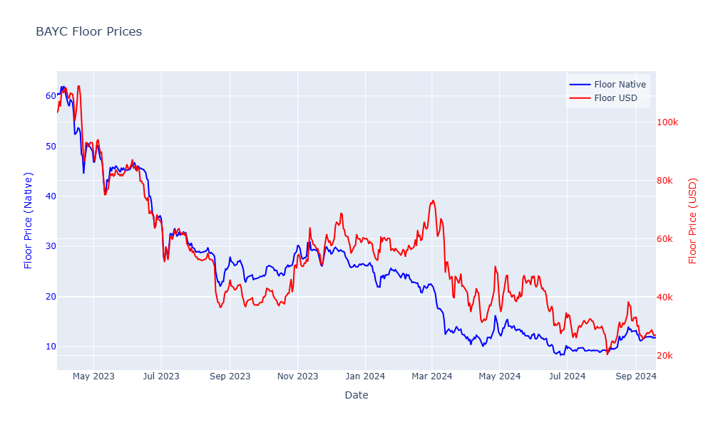
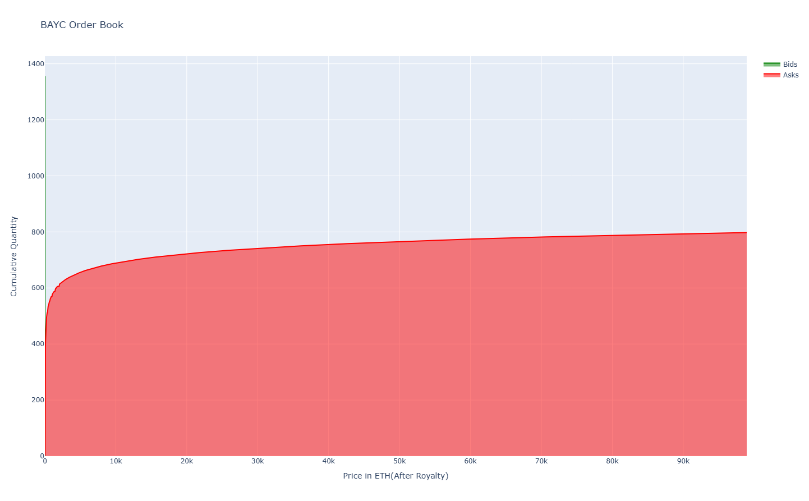
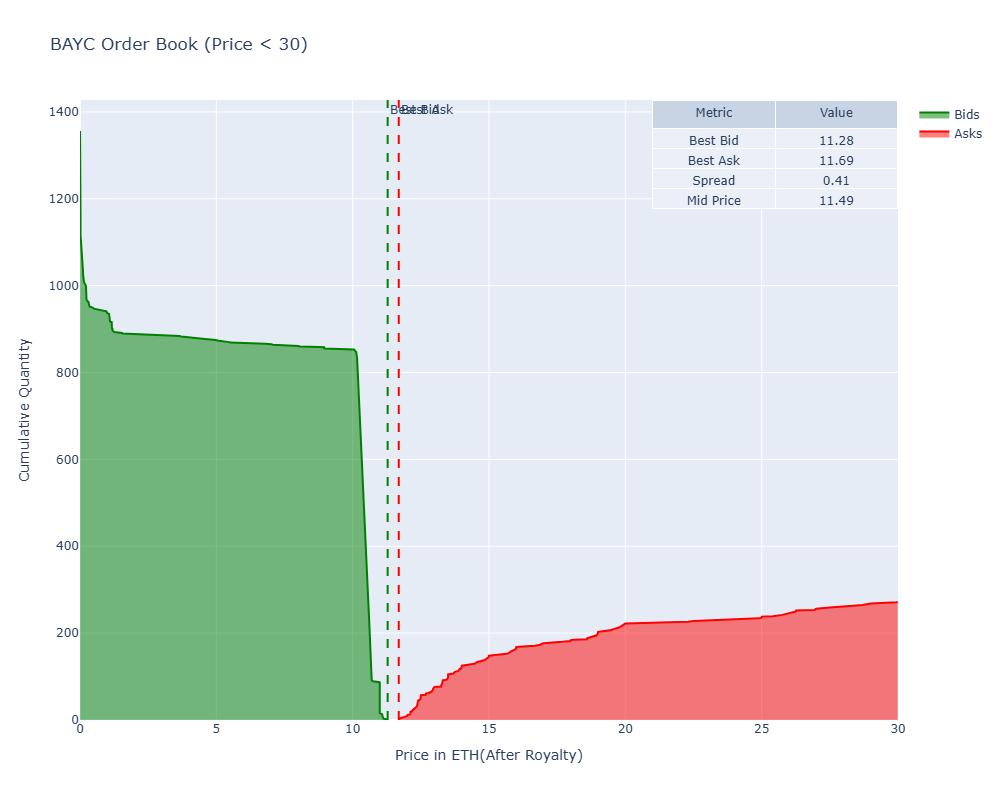

<style type="text/css">
  body{
  font-size: 14pt;
}
</style>


```{r setup, include=FALSE}
knitr::opts_chunk$set(echo = TRUE)
```


```{r Packages, warning=FALSE, message=FALSE}
library(knitr)
library(kableExtra)
```

# WHY choosing BAYC

BAYC continues to innovate and expand its ecosystem, as evidenced by the introduction of the L3 Ape Chain and the Dookey Dash game. The ongoing collaboration with Animoca Brands suggests strategic growth initiatives are in place.

The project's continuous development and strong community support indicate resilience in the face of market fluctuations. The availability of yield-generating opportunities adds practical utility for holders.

From a valuation standpoint, the current price may represent an attractive entry point, especially when compared to its historical peak.

# Collection Traits

There is a table of all traits in the collection, along with the number of instances.
```{r, echo = FALSE}
trait <- read.csv('trait&count.csv')
kable(trait) |>
  kable_styling("striped", full_width = F) |>
  scroll_box(width = "100%", height = "500px")
```
# MetaData - IPFS link

```{r, echo = FALSE}
metad <- read.csv('metadf.csv')

kable(metad) |>
  kable_styling("striped", full_width = F) |>
  scroll_box(width = "70%", height = "300px")
```

# BAYC trades in both USD and ETH

Trades are plotted as 1d OHLC, in both ETH and USD value. 

Data Query via Dune(https://dune.com/queries/4077526)

Tap the figure to further zoom in/out

<a href="ETH_Chart.html" class="image-link">
  
</a>


<a href="USD_Chart.html" class="image-link">
  
</a>

# BAYC floor price in both USD and ETH

BAYC floor price in line plots, in both ETH and USD value. 

Data fetched from https://nftpricefloor.quickapi.io/ api. 

<a href="FloorPrice.html" class="image-link">
  
</a>


# Order book

BAYC Order book snapshot. Both the entire book and bids & asks under 30 eth. 

<a href="OrderBook.html" class="image-link">
  
</a>

<a href="OrderBook_30.html" class="image-link">
  
</a>

# Funding

Here is a table of blur lending rates, ordered by block_heights

```{r, echo=FALSE}
fund <- read.csv('blurlendingrate.csv')
kable(fund) |>
  kable_styling("striped", full_width = F) |>
  scroll_box(width = "30%", height = "300px")
```

# Liquidity Analysis

## Market Overview

- **Market Capitalization**: $267,950,000
  - Calculation: 10,000 NFTs * 11.5 ETH/NFT * $2,330/ETH

- **Monthly Trading Volume**: < $1 million
  - Notably low for its market cap

## Comparative Analysis

- **Manta** (ranked 100+ by market cap):
  - Daily volume: > $18 million
  - BAYC's volume is significantly lower despite higher market cap

## Liquidity Indicators

### Bid-Ask Spread
- Current spread: 3.6%
- Interpretation: Relatively wide, indicating potential liquidity concerns

### Order Book Depth
- 800 bids within 10% of mid-price
- Suggests good depth for an NFT collection

## Trading Suitability

- Appropriate for trading activities < $1 million
- Deep order book provides some liquidity cushion

## Conclusion

BAYC presents a mixed liquidity profile:

- **Challenges**: Low trading volume and wide spread
- **Strengths**: Substantial order book depth
- **Market Dynamics**: High market cap despite low recent volumes suggests strong holder conviction or reduced selling pressure

The collection can likely support moderate trading activity, but larger transactions may face liquidity constraints.


# The Price <- Everything

The Bored Ape Yacht Club (BAYC) NFT collection exhibits moderate liquidity, with trading volumes relatively low compared to its market capitalization. In contrast, ApeCoin (APE) demonstrates a more robust market presence, boasting a market capitalization of $460 million and a daily trading volume of $53 million. This higher liquidity in ApeCoin compared to BAYC NFTs suggests that the price movements of the BAYC collection will largely be influenced by the price action of ApeCoin.

BAYC NFTs can be staked to generate ApeCoin, offering a current Annual Percentage Rate (APR) of over 16%. This staking mechanism creates a strong correlation between the valuation of BAYC and the performance of ApeCoin. Analysis of previous trading data and order book activity indicates that there is more buying pressure than selling pressure, which creates favorable conditions for yield-generating strategies within the BAYC ecosystem.

In the broader NFT market, several key factors influence pricing. These include trading volume, buy/sell pressure, and the performance of underlying cryptocurrencies, particularly Ethereum (ETH). Additionally, funding rates are often overlooked in discussions about NFT valuations. The largest NFT lending platform on Ethereum, Blur, currently has a Total Value Locked (TVL) of only $27 million, suggesting that it may not significantly impact overall NFT prices.
Despite the limited number of borrowers and lenders in this space, there remains an opportunity for liquidity provision and yield farming. The lending market offers yields exceeding 5% APR, which is competitive when compared to traditional financial instruments like U.S. Treasury bills. 

In conclusion, while BAYC's direct liquidity may be moderate, its ecosystem, particularly through ApeCoin, presents significant opportunities for yield generation. The high staking APR for BAYC combined with the liquid market for ApeCoin creates an appealing landscape for yield-seeking investors. As the NFT lending market continues to develop, it offers competitive yields that could attract more participants looking to provide liquidity in this emerging space. This format organizes your analysis into clear paragraphs, making it easier to read and understand while maintaining the key points from your original text.

